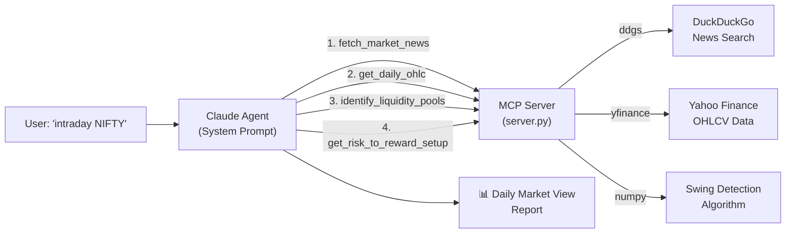
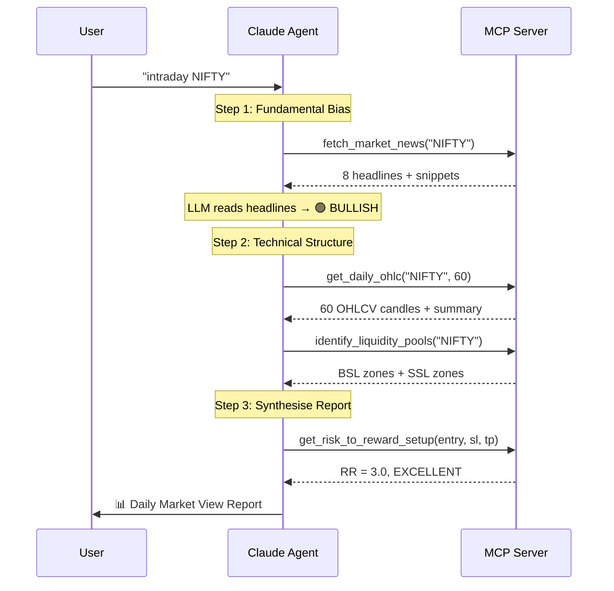

# MCP Trading Agent — Complete Walkthrough

> ICT / SMC Technical Analyst + Fundamental News Sentiment — powered by Model Context Protocol

## Architecture Overview



## Project Structure

```
mcp-trading-agent/
├── server.py              ← MCP server — tool registrations & entry point
├── config.py              ← Centralised configuration (all tuneable knobs)
├── system_prompt.py       ← Agent system prompt (inject into client)
├── requirements.txt       ← Python dependencies
├── README.md              ← Developer docs
├── __init__.py
└── tools/
    ├── __init__.py
    ├── market_data.py     ← get_daily_ohlc, identify_liquidity_pools
    ├── news.py            ← fetch_market_news (DuckDuckGo)
    └── risk_reward.py     ← get_risk_to_reward_setup
```

## Files Created

| File | Purpose |
|------|---------|
| [server.py](file:///c:/Github/ai-company/mcp-trading-agent/server.py) | Main MCP server — thin adapter layer registering 4 tools with rich docstrings |
| [config.py](file:///c:/Github/ai-company/mcp-trading-agent/config.py) | Centralised config with env-var overrides (transport, port, look-back windows) |
| [system_prompt.py](file:///c:/Github/ai-company/mcp-trading-agent/system_prompt.py) | Full agent system prompt defining "Nexus" persona and macro-command workflow |
| [tools/market_data.py](file:///c:/Github/ai-company/mcp-trading-agent/tools/market_data.py) | yfinance OHLCV + rolling-window swing detection for liquidity pools |
| [tools/news.py](file:///c:/Github/ai-company/mcp-trading-agent/tools/news.py) | DuckDuckGo text search via `ddgs` — returns raw headlines for LLM sentiment |
| [tools/risk_reward.py](file:///c:/Github/ai-company/mcp-trading-agent/tools/risk_reward.py) | Pure-function RR calculator with quality verdict |
| [requirements.txt](file:///c:/Github/ai-company/mcp-trading-agent/requirements.txt) | Pinned dependencies (mcp, yfinance, ddgs, pandas, numpy, httpx) |
| [README.md](file:///c:/Github/ai-company/mcp-trading-agent/README.md) | Quick-start guide and integration instructions |

## Exposed MCP Tools

| Tool | Input | Returns |
|------|-------|---------|
| `get_daily_ohlc` | `ticker`, `days=60` | OHLCV candles + summary (latest close, period high/low, avg volume) |
| `identify_liquidity_pools` | `ticker` | Buy-side liquidity (swing highs above price), Sell-side liquidity (swing lows below) |
| `fetch_market_news` | `ticker`, `max_results=8` | Raw headlines + snippets for LLM sentiment analysis |
| `get_risk_to_reward_setup` | `entry`, `stop_loss`, `target` | Direction, RR ratio, risk/reward in points & percent, quality verdict |

## Validation Results

All 4 tools tested successfully:

````carousel
```
✅ get_daily_ohlc("NIFTY", 5)
   → 5 candles returned
   → Latest close: 24,176.15
```
<!-- slide -->
```
✅ identify_liquidity_pools("NIFTY")
   → Current price: 24,176.15
   → Buy-side liquidity zones: 7
   → Sell-side liquidity zones: 8
```
<!-- slide -->
```
✅ fetch_market_news("NIFTY", 3)
   → 3 articles returned
   → Headlines successfully fetched from DuckDuckGo
```
<!-- slide -->
```
✅ get_risk_to_reward_setup(24200, 24100, 24500)
   → Direction: LONG
   → RR Ratio: 3.0
   → Verdict: EXCELLENT — High RR setup
```
````

## Quick Start

### 1. Install dependencies
```bash
cd c:\Github\ai-company\mcp-trading-agent
pip install -r requirements.txt
```

### 2. Run the server

**stdio transport** (for Claude Desktop / Claude Code):
```bash
python server.py
```

**HTTP transport** (for MCP Inspector / web clients):
```bash
# Windows
set MCP_TRANSPORT=streamable-http
python server.py

# PowerShell
$env:MCP_TRANSPORT="streamable-http"; python server.py
```

### 3. Claude Desktop Integration

Add to your Claude Desktop config (`%APPDATA%\Claude\claude_desktop_config.json`):

```json
{
  "mcpServers": {
    "trading-agent": {
      "command": "python",
      "args": ["C:\\Github\\ai-company\\mcp-trading-agent\\server.py"]
    }
  }
}
```

### 4. Test with MCP Inspector

```bash
# Start server in HTTP mode first, then:
npx -y @modelcontextprotocol/inspector
# Connect to http://localhost:8000/mcp
```

## Macro-Command Workflow

When a user types `intraday NIFTY` or `view AAPL`, the system prompt instructs the agent to automatically:



## Key Design Decisions

> [!IMPORTANT]
> **The LLM does the heavy lifting**: The Python server is a "dumb" data pipeline — it fetches raw text and numbers. Claude's intelligence handles the hard part: reading headlines to determine sentiment, interpreting price structure, and proposing institutional-grade trade setups.

> [!TIP]
> **Ticker aliases**: Users can type `NIFTY`, `BTC`, `GOLD`, `CRUDE` etc. The server automatically resolves these to yfinance symbols (`^NSEI`, `BTC-USD`, `GC=F`, `CL=F`).

> [!NOTE]
> **Confluence enforcement**: The system prompt instructs the agent to only propose a trade when fundamental bias ALIGNS with technical structure. If they diverge, it outputs "NO HIGH-CONVICTION SETUP" instead of forcing a bad trade.

## Supported Ticker Aliases

| User Types | Resolves To | Description |
|-----------|-------------|-------------|
| NIFTY | ^NSEI | NIFTY 50 Index |
| BANKNIFTY | ^NSEBANK | NIFTY Bank Index |
| SENSEX | ^BSESN | BSE SENSEX |
| SPX | ^GSPC | S&P 500 |
| SPY | SPY | SPDR S&P 500 ETF |
| QQQ | QQQ | Invesco NASDAQ 100 ETF |
| DXY | DX-Y.NYB | US Dollar Index |
| GOLD | GC=F | Gold Futures |
| CRUDE | CL=F | Crude Oil Futures |
| BTC | BTC-USD | Bitcoin |
| ETH | ETH-USD | Ethereum |
