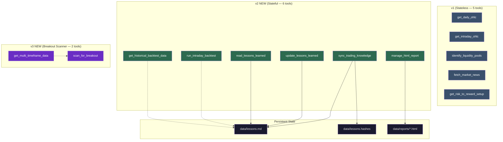
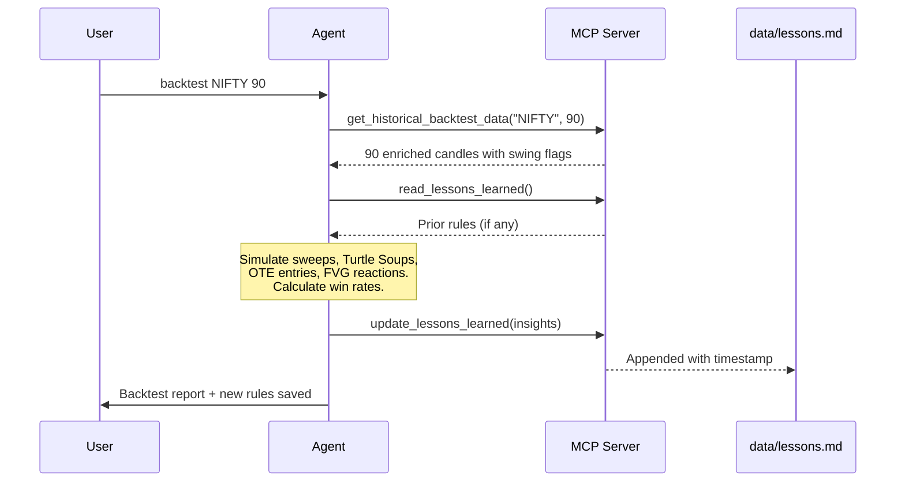
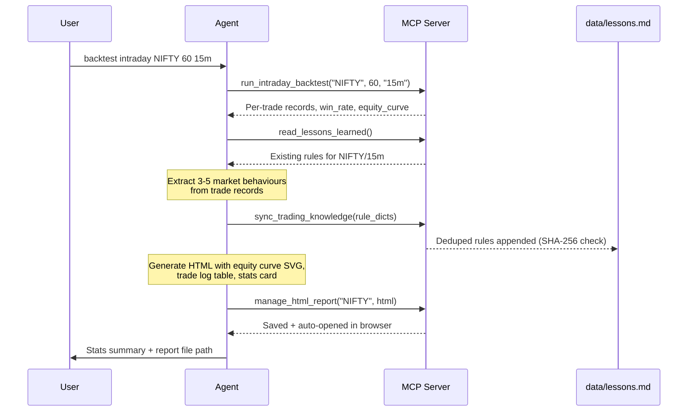
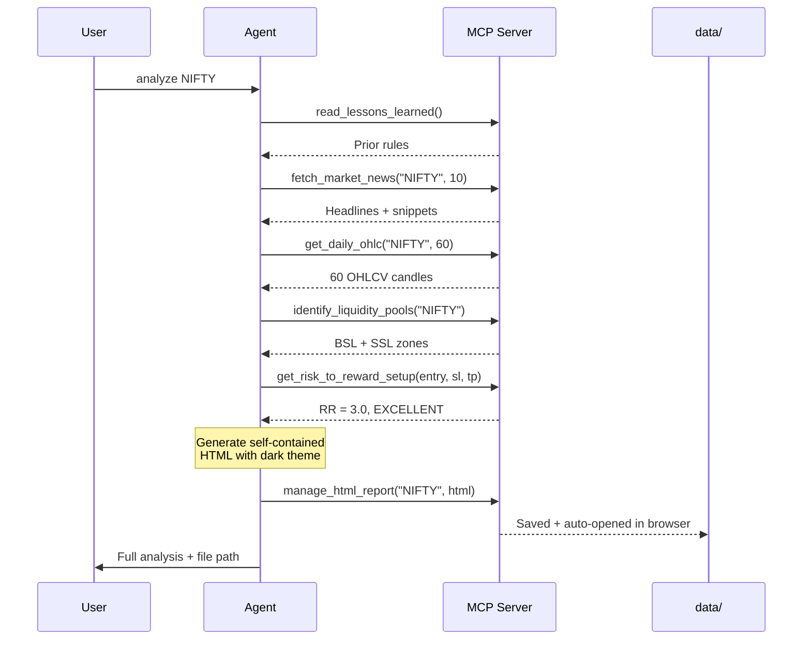
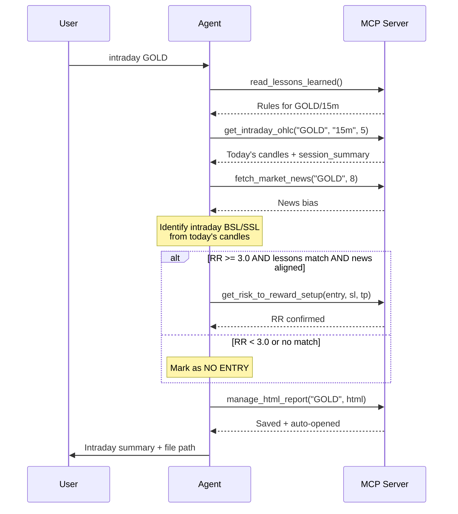
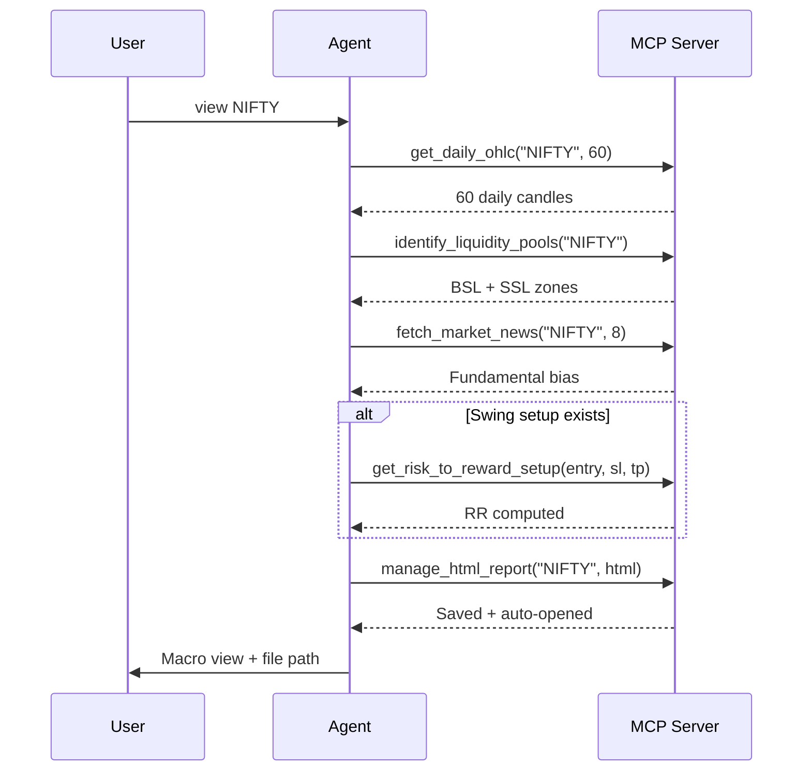
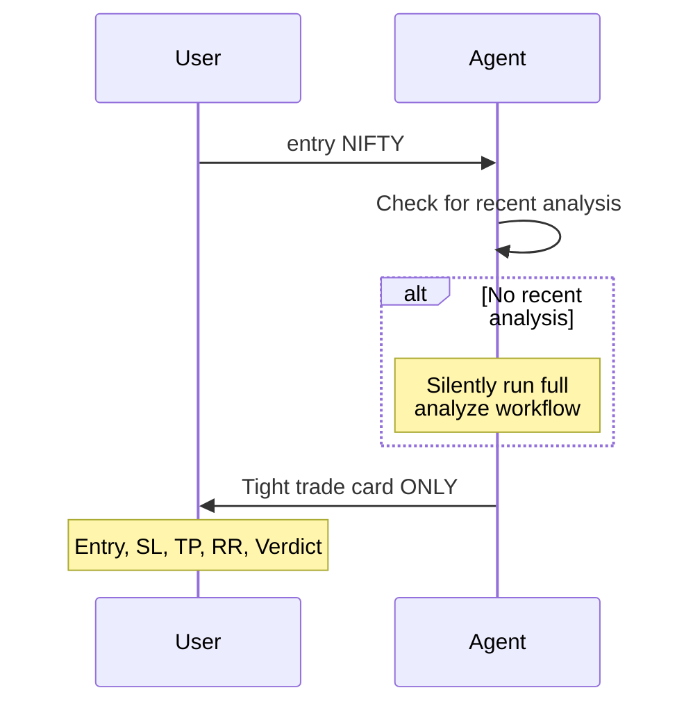
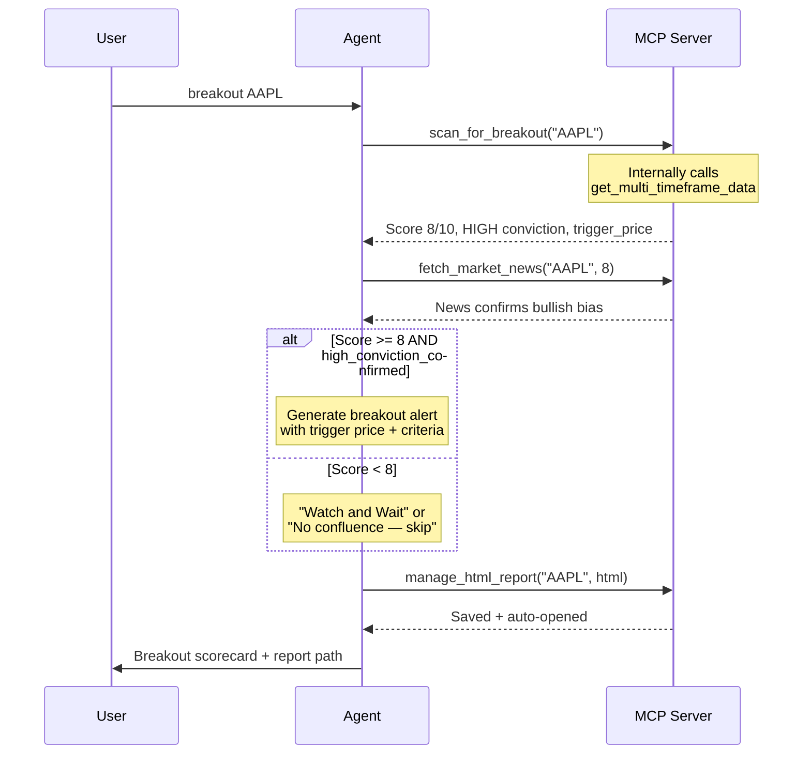

# MCP Trading Agent v3.0 — Upgrade Walkthrough

> Stateless analyst ➜ Stateful learning system ➜ Multi-timeframe breakout scanner with persistent memory, automated backtesting, and HTML reports.

## Evolution Overview



## Files Modified / Created

| File | Action | Purpose |
|------|--------|---------|
| [server.py](file:///c:/Github/ai-company/mcp-trading-agent/server.py) | **Rewritten** | 13 tool registrations (was 4 in v1) |
| [config.py](file:///c:/Github/ai-company/mcp-trading-agent/config.py) | **Updated** | v2.0.0 config, backtest + retention settings |
| [system_prompt.py](file:///c:/Github/ai-company/mcp-trading-agent/system_prompt.py) | **Rewritten** | Nexus v2 persona, 6 command workflows |
| [CLAUDE.md](file:///c:/Github/ai-company/mcp-trading-agent/CLAUDE.md) | **Rewritten** | v3 prompt for Claude Code auto-load |
| [tools/market_data.py](file:///c:/Github/ai-company/mcp-trading-agent/tools/market_data.py) | **Extended** | +get_intraday_ohlc, +get_historical_backtest_data, +run_intraday_backtest, +get_multi_timeframe_data, +scan_for_breakout |
| [tools/persistence.py](file:///c:/Github/ai-company/mcp-trading-agent/tools/persistence.py) | **NEW** | HTML reports, lessons.md CRUD, sync_trading_knowledge with SHA-256 dedup |
| [tools/news.py](file:///c:/Github/ai-company/mcp-trading-agent/tools/news.py) | Unchanged | DuckDuckGo news fetcher |
| [tools/risk_reward.py](file:///c:/Github/ai-company/mcp-trading-agent/tools/risk_reward.py) | Unchanged | RR ratio calculator |

## Updated Project Structure

```
mcp-trading-agent/
├── server.py                 # 13 MCP tools registered (v1 + v2 + v3)
├── config.py                 # v2.0.0 config (ServerConfig dataclass)
├── system_prompt.py          # Nexus v2 persona — 6 command workflows
├── CLAUDE.md                 # Auto-loaded by Claude Code
├── requirements.txt          # mcp[cli], yfinance, ddgs, pandas, numpy, httpx
├── README.md
├── tools/
│   ├── __init__.py
│   ├── market_data.py        # 7 functions: daily, intraday, liquidity, backtest, MTF, breakout
│   ├── news.py               # fetch_market_news (DuckDuckGo)
│   ├── risk_reward.py        # get_risk_to_reward_setup
│   └── persistence.py        # manage_html_report, lessons CRUD, sync_trading_knowledge
└── data/                     # Persistent state (auto-created)
    ├── lessons.md             # Knowledge base (auto-created with template)
    ├── lessons.hashes         # SHA-256 dedup sidecar for sync_trading_knowledge
    └── reports/               # HTML reports (30-day auto-purge)
        └── NIFTY_2026-05-13.html
```

## All 13 Tools — Reference

````carousel
```
ORIGINAL TOOLS (v1) — 5 tools
==============================
[1] get_daily_ohlc           — Daily OHLCV candles (60-day default)
[2] get_intraday_ohlc        — Sub-daily candles (1m/5m/15m/30m/60m)
[3] identify_liquidity_pools — Swing high/low detection (BSL/SSL)
[4] fetch_market_news        — DuckDuckGo news search
[5] get_risk_to_reward_setup — RR ratio + quality verdict
```
<!-- slide -->
```
STATEFUL TOOLS (v2) — 6 tools
==============================
[6]  get_historical_backtest_data — Extended OHLCV with swing flags (10-500 days)
[7]  run_intraday_backtest        — Automated SMC setup scan with walk-forward sim
[8]  manage_html_report           — Save HTML + auto-open browser + 30-day purge
[9]  read_lessons_learned         — Read persistent lessons.md knowledge base
[10] update_lessons_learned       — Append free-form insights to lessons.md
[11] sync_trading_knowledge       — Deduplicate + persist structured rules (SHA-256)
```
<!-- slide -->
```
BREAKOUT SCANNER (v3) — 2 tools
================================
[12] get_multi_timeframe_data — Monthly + Weekly + Daily OHLCV in one call
[13] scan_for_breakout        — 1-10 scoring across M/W/D with conviction tiers

     Scoring: Monthly (3 pts) + Weekly (3 pts) + Daily (4 pts)
     Tiers:   8-10 HIGH | 5-7 MODERATE | 1-4 LOW
     Gate:    high_conviction_confirmed = TRUE only when
              Monthly + Weekly both BULLISH AND score >= 8
```
````

## Command Workflows

The agent recognises 7 plain-text keyword commands (not slash commands — Claude Code reserves `/` for built-ins):

| Command | Trigger | Data Source |
|---------|---------|-------------|
| `backtest [ticker] [days]` | "backtest NIFTY 90" | get_historical_backtest_data |
| `backtest intraday [ticker] [days] [interval]` | "backtest intraday NIFTY 60 15m" | run_intraday_backtest |
| `analyze [ticker]` | "analyze AAPL" | get_daily_ohlc + identify_liquidity_pools |
| `entry [ticker]` | "entry BTC" | (runs analyze silently if needed) |
| `intraday [ticker]` | "intraday GOLD" | get_intraday_ohlc (15m) — 1:3 RR gate |
| `view [ticker]` | "view NIFTY" | get_daily_ohlc (daily 60d) |
| `breakout [ticker or list]` | "breakout NIFTY, BTC" | get_multi_timeframe_data + scan_for_breakout |

> [!IMPORTANT]
> **Tool routing is mandatory:**
> - `intraday` → `get_intraday_ohlc` (never daily)
> - `view` / `analyze` → `get_daily_ohlc` (never intraday)
> - `backtest intraday` → `run_intraday_backtest` (not get_historical_backtest_data)

---

### backtest [ticker] [days] — Daily Timeframe



### backtest intraday [ticker] [days] [interval] — Automated SMC Scan



### analyze [Stock Name]



### intraday [ticker] — Live Session Analysis (1:3 RR Gate)



### view [ticker] — Macro Daily Swing View



### entry [Stock Name]



## Breakout Scanner (v3) — Fully Wired

> [!NOTE]
> `get_multi_timeframe_data` and `scan_for_breakout` are registered in `server.py` and
> the full `breakout [ticker]` command workflow is implemented in both `CLAUDE.md` and
> `system_prompt.py`. See the 6-step workflow below.

### Breakout Workflow



## Sync Status — Docs vs Code

| Item | Code | `system_prompt.py` | `CLAUDE.md` | `README.md` |
|------|------|--------------------|-------------|-------------|
| Total tools | **13** ✅ | **13** ✅ | **13** ✅ | **13** ✅ |
| get_intraday_ohlc | ✅ | ✅ | ✅ | ✅ |
| run_intraday_backtest | ✅ | ✅ | ✅ | ✅ |
| sync_trading_knowledge | ✅ | ✅ | ✅ | ✅ |
| get_multi_timeframe_data | ✅ | ✅ | ✅ | ✅ |
| scan_for_breakout | ✅ | ✅ | ✅ | ✅ |
| `breakout` command workflow | ✅ | ✅ | ✅ | ✅ |
| `backtest intraday` command | ✅ | ✅ | ✅ | ✅ |
| Intraday 1:3 RR gate | ✅ | ✅ | ✅ | ✅ |
| SHA-256 dedup in sync | ✅ | ✅ | ✅ | ✅ |
| Tool count in entrypoint log | `tools=13` ✅ | — | — | — |
| Project structure (persistence.py, data/) | — | — | — | ✅ |

All docs are in sync with the codebase. No outstanding gaps.

## How to Use

The MCP server is already registered in Claude Code. Just restart your session:

```powershell
cd C:\Github\ai-company\mcp-trading-agent
claude
```

Then try:
```
backtest NIFTY 90
backtest intraday NIFTY 60 15m
analyze AAPL
entry BTC
intraday GOLD
view NIFTY
```

> [!TIP]
> Run `backtest` or `backtest intraday` first for a ticker before `analyze` — the agent learns patterns and applies them in future analyses, making its edge compound over time.

> [!TIP]
> Run `breakout` to scan multiple tickers at once: `breakout NIFTY, BTC, GOLD`
> The agent scores each ticker 1-10 across Monthly / Weekly / Daily and opens
> a Watchlist HTML report automatically. HIGH conviction setups are saved to
> `lessons.md` so the `entry` command can track them next session.
